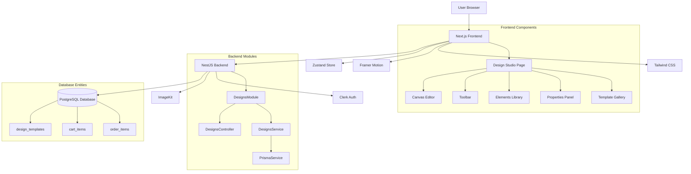
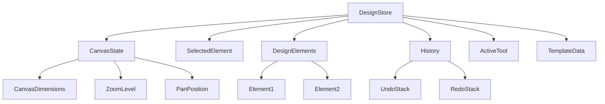
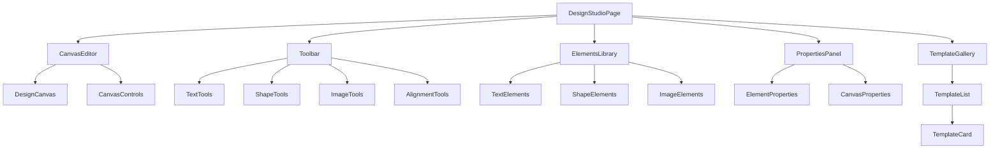
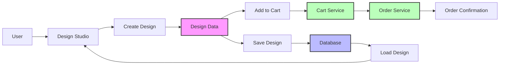

# Phase 5: Design Studio & Customization - Technical Report (Revised)

## 1. Overview
Phase 5 delivers a Canva-like design studio for personalized products. Users can compose designs with text, shapes, and images; transform elements (drag/resize/rotate), align and snap, manage layers, undo/redo, autosave, preview, and then attach the design to cart/order via `designData`.

## 2. Architecture & Tech Stack
- Frontend: Next.js (TypeScript), Tailwind CSS, Framer Motion (UI animations), Zustand (state + history).
- Canvas Engine: Fabric.js for rich interactions and faster delivery.
  - Render Engine Abstraction: A thin interface (render engine adapter) to allow future swap to Konva.js or SVG/vanilla if needed.
- Media: ImageKit (assets, thumbnails) with signed admin uploads and parameterized delivery.
- Auth: Clerk (route protection, ownership checks).
- Backend: NestJS DesignsModule + Prisma; reuse `designData` fields on `CartItem`/`OrderItem` for order integration.

## 3. Data Model (Design JSON)
DesignDocument
- id, name, width, height, background
- elements: DesignElement[]
- isTemplate?, createdAt, updatedAt

DesignElement (base)
- id, type, x, y, width, height, rotation, opacity, zIndex, locked, selectable, visible
- Text: content, fontFamily, fontSize, fontStyle, fontWeight, lineHeight, letterSpacing, color, textAlign
- Image: src (ImageKit path), originalSize, objectFit, clipPath?
- Shape: kind (rect|circle|line|polygon), stroke, strokeWidth, fill, cornerRadius

Constraints & Limits
- Grid/snapping options, optional guides/rulers
- Max JSON size ~1MB/design, max elements (e.g., 300) configurable

## 4. Backend (NestJS) Design Module
Endpoints
- Templates (public read, admin write)
  - GET `/api/designs/templates` (cached)
  - POST `/api/designs/templates` (admin)
  - PUT `/api/designs/templates/:id` (admin)
  - DELETE `/api/designs/templates/:id` (admin)
- User Designs (auth + ownership)
  - POST `/api/designs`
  - GET `/api/designs/:id`
  - PUT `/api/designs/:id`
  - DELETE `/api/designs/:id`

Validation & Security
- Guards: ClerkGuard for user designs; AdminGuard for templates
- DTOs: class-validator (size, element count, allowed fields), JSON schema validation for `designData`
- Rate-limit: Token/IP limits on save/autosave
- Sanitization: Prevent XSS via input sanitizers and strict allow-lists

Persistence & Integration
- Prisma entities: `design_templates` + use `designData` in `cart_items` and `order_items`
- Order: embed minimal snapshot into `OrderItem.designData` on order creation
- Caching: templates listing (in-memory/Redis optional)

## 5. Frontend (Next.js) Design Studio
Route & Structure
- Route: `/design-studio`
- Layout: TopBar (undo/redo, zoom, align, layers, save/preview), Left Sidebar (Elements Library), Canvas Panel, Right Sidebar (Properties)

State Management (Zustand)
- present/past/future history, selectionIds[], document, zoom/pan, isDirty, autosaveAt
- actions: add/update/delete, selection, ordering (front/back), align/distribute, transform, zoom/pan
- middleware: bounded history, debounced autosave (1–2s), optimistic updates

Canvas (Fabric.js)
- Hit-testing, transform handles (scale/rotate), snapping (grid/edges), keyboard shortcuts (Delete, Ctrl/Cmd+Z/Y, arrow nudge)
- rAF throttling during transforms; memoized element views

Preview & Export
- Live preview mode (UI-less render)
- Image export via canvas snapshot; thumbnails 200x200 and 400x400 (store in ImageKit if needed)

Assets (ImageKit)
- Folders: `design-assets/icons/*`, `design-assets/backgrounds/*`, `design-templates/thumbnails/*`
- Admin uploads via signed requests; public read for rendering
- Delivery params: width/height/quality/fit/dpr

## 6. Performance Targets (KPIs)
- First paint < 1.8s (P75), Time-to-Interactive < 2.2s (P75)
- Interactions ≈ 60 FPS up to ~150 elements; ≥ 45 FPS up to ~300 elements
- Designs CRUD P95 < 800ms; template gallery P95 < 1.2s
- Design JSON target ≤ 800KB (hard cap 1MB)
- Thumbnails at 256x256 and 512x512; generation P95 < 600ms

## 7. Accessibility & Mobile
- WCAG 2.1 AA: keyboard navigation, focus management, color contrast
- Touch gestures: drag/scale/rotate with multi-touch where possible; larger hit targets
- Responsive scaling of canvas and panels

## 8. Testing Strategy
Unit
- Geometry utils (hit-test, transforms), store reducers (undo/redo), DTO validators

Integration
- Designs CRUD, autosave debounce behavior, template caching

E2E (Playwright)
- Create/edit/save/load design, apply template, cart/order flow, guest→user merge

Cross-browser & Mobile
- Chrome, Firefox, Safari, Edge; iOS/Android devices

## 9. Implementation Plan (8 Weeks)
Week 1 (Backend Foundations)
- DesignsModule scaffolding; templates CRUD; user designs CRUD
- DTOs + guards (Clerk/Admin) + validation + rate-limit; template caching; unit tests

Week 2 (API Hardening & Docs)
- Error handling normalization; ownership checks; JSON schema validation path
- API docs; initial integration tests; performance baselines (templates/designs list)

Week 3 (Frontend Foundation)
- `/design-studio` route; Fabric.js canvas MVP (add/move/scale/rotate)
- Zustand store + history; debounced autosave; DesignService (API client); auth guard

Week 4 (Core Editing I)
- Elements Library (text/shape/image) drag-in; snapping (grid/edges); alignment tools
- Keyboard shortcuts; basic properties panel (text/font/color/size)

Week 5 (Core Editing II)
- Layers ordering; group/ungroup (basic); improved handles; preview/export
- Performance pass (rAF throttling, memoization); accessibility polish (focus/labels)

Week 6 (Templates & Assets)
- Template gallery; apply-from-template flow; ImageKit asset browser
- Thumbnails (256/512) generation pipeline; caching improvements

Week 7 (Mobile & Responsive)
- Touch gestures; adaptive canvas scaling; larger hit targets; mobile layout of panels
- Cross-browser/mobile test pass; bug fixes

Week 8 (Integration & QA)
- Cart/order embedding; order confirmation preview; E2E flows
- KPI verification; regression and performance passes; release readiness checklist

## 10. Risks & Mitigations
- Canvas performance: rAF throttling, memoization, element caps, lazy asset loading
- Dependency risk (Fabric.js): render-engine adapter for swap to Konva/SVG
- Data bloat: JSON/element limits, compress previews, paginate templates
- Mobile UX: gesture-first design, larger handles, device test matrix

## 11. Success Criteria
- Stable transform, snap, undo/redo; reliable autosave; seamless save/load
- Template apply flow; design embedded in orders; previews visible in cart/order
- Meets KPIs; passes accessibility checks; smooth mobile experience

## 12. Next Steps
- Finalize Design JSON types in `shared/types/design.ts`
- Scaffold DesignsModule + DTOs and guards; wire endpoints
- Implement `/design-studio` MVP with Fabric.js + Zustand history and autosave

Phase 5 of the MeriDesignHouse project focuses on implementing a Canvas-based design editor for personalized product customization. This feature will allow users to create custom designs for products like wedding invitations, greeting cards, and personalized decorations. The design studio will provide a Canva-like experience with customizable elements, design templates, and seamless integration with the ordering system.

## Project Context

According to the project roadmap, Phase 5 is currently 20% complete with only the database model for design templates implemented. The main components that need to be developed include:
- Canvas-based design editor
- Customizable elements (name, date, font, color)
- Ready-made design elements library
- Design save and load functionality
- Design preview system
- Design data integration with orders
- Responsive design editor
- Mobile design experience optimization

## Current Status Analysis

Based on the project documentation and codebase analysis:

### Completed Components
- ✅ Design template database model (`DesignTemplate`) is implemented in Prisma schema
- ✅ Design data field exists in `CartItem` and `OrderItem` models
- ✅ Backend API endpoints for design functionality are planned in documentation
- ✅ Link to "Tasarım Atölyesi" exists on the homepage but the route is not implemented

### Missing Components
- ⏳ Canvas-based design editor component
- ⏳ Design template management APIs
- ⏳ Design save/load functionality
- ⏳ Design preview system
- ⏳ Frontend design studio route and pages
- ⏳ Ready-made design elements library
- ⏳ Responsive design editor
- ⏳ Mobile design experience optimization

## Technical Architecture

The following diagram illustrates the overall architecture of the design studio feature:



### Backend Architecture

#### Database Schema
The database already includes the `design_templates` table with the following structure:
```prisma
model DesignTemplate {
  id          String   @id @default(cuid())
  name        String
  description String?
  thumbnail   String?
  elements    Json     // Design elements configuration
  isActive    Boolean  @default(true)
  createdAt   DateTime @default(now())
  updatedAt   DateTime @updatedAt
}
```

The `CartItem` and `OrderItem` models already include a `designData` JSON field for storing custom design information.

##### Design Data Structure
The `designData` JSON field will contain the following structure:
```json
{
  "version": "1.0",
  "canvas": {
    "width": 800,
    "height": 600,
    "background": "#ffffff"
  },
  "elements": [
    {
      "id": "element1",
      "type": "text",
      "content": "John & Jane",
      "x": 100,
      "y": 100,
      "width": 200,
      "height": 50,
      "styles": {
        "fontFamily": "Arial",
        "fontSize": 24,
        "color": "#000000",
        "fontWeight": "bold"
      }
    },
    {
      "id": "element2",
      "type": "image",
      "src": "https://example.com/flower.png",
      "x": 50,
      "y": 200,
      "width": 100,
      "height": 100
    }
  ]
}
```

##### Design Template Elements Structure
The `elements` field in `DesignTemplate` will contain predefined elements that users can customize:
```json
{
  "version": "1.0",
  "canvas": {
    "width": 800,
    "height": 600,
    "background": "#f5f5f5"
  },
  "elements": [
    {
      "id": "namePlaceholder",
      "type": "text",
      "content": "[Name Placeholder]",
      "x": 200,
      "y": 150,
      "width": 400,
      "height": 60,
      "editable": true,
      "styles": {
        "fontFamily": "Georgia",
        "fontSize": 32,
        "color": "#333333",
        "textAlign": "center"
      }
    },
    {
      "id": "datePlaceholder",
      "type": "text",
      "content": "[Date Placeholder]",
      "x": 200,
      "y": 250,
      "width": 400,
      "height": 40,
      "editable": true,
      "styles": {
        "fontFamily": "Arial",
        "fontSize": 20,
        "color": "#666666",
        "textAlign": "center"
      }
    },
    {
      "id": "decoration1",
      "type": "image",
      "src": "https://example.com/decoration.png",
      "x": 50,
      "y": 50,
      "width": 100,
      "height": 100,
      "editable": false
    }
  ]
}
```

#### API Endpoints
According to the project documentation, the following API endpoints need to be implemented:

| Method | Endpoint | Description | Authentication |
|--------|----------|-------------|---------------|
| GET | /api/designs/templates | Retrieve all active design templates | Public |
| POST | /api/designs | Save a new user design | User |
| GET | /api/designs/:id | Load a saved user design | Owner/Admin |
| PUT | /api/designs/:id | Update a saved user design | Owner/Admin |
| DELETE | /api/designs/:id | Delete a saved user design | Owner/Admin |
| POST | /api/designs/templates | Create a new design template | Admin |
| PUT | /api/designs/templates/:id | Update a design template | Admin |
| DELETE | /api/designs/templates/:id | Delete a design template | Admin |

1. **Design Template Management**
   - `GET /api/designs/templates` - Retrieve all active design templates
   - `POST /api/designs` - Save a new design
   - `GET /api/designs/:id` - Load a saved design
   - `PUT /api/designs/:id` - Update a saved design
   - `DELETE /api/designs/:id` - Delete a saved design

2. **Design Data Integration**
   - Design data will be stored in the `designData` field of `CartItem` and `OrderItem`
   - When an order is created, design data from cart items will be transferred to order items

#### Backend Modules
A new `DesignsModule` needs to be created with the following components:
- `DesignsController` - Handle HTTP requests for design operations
- `DesignsService` - Business logic for design management
- DTOs for design operations:
  - `CreateDesignDto`
  - `UpdateDesignDto`
  - `DesignTemplateDto`

##### Module Structure
```
backend/src/designs/
├── designs.module.ts
├── designs.controller.ts
├── designs.service.ts
├── dto/
│   ├── create-design.dto.ts
│   ├── update-design.dto.ts
│   └── index.ts
└── interfaces/
    └── design.interface.ts
```

##### DTO Definitions

**CreateDesignDto**
```typescript
import { IsString, IsObject, IsOptional, IsBoolean } from 'class-validator';

export class CreateDesignDto {
  @IsString()
  name: string;

  @IsString()
  @IsOptional()
  description?: string;

  @IsObject()
  designData: Record<string, any>;

  @IsString()
  @IsOptional()
  templateId?: string;

  @IsBoolean()
  @IsOptional()
  isPublic?: boolean;
}
```

**UpdateDesignDto**
```typescript
import { PartialType } from '@nestjs/mapped-types';
import { CreateDesignDto } from './create-design.dto';

export class UpdateDesignDto extends PartialType(CreateDesignDto) {}
```

**DesignTemplateDto**
```typescript
export class DesignTemplateDto {
  id: string;
  name: string;
  description?: string;
  thumbnail?: string;
  elements: Record<string, any>;
  isActive: boolean;
  createdAt: Date;
  updatedAt: Date;
}
```

### Frontend Architecture

The following diagram shows the state management structure for the design studio:



#### Component Structure
The frontend will require the following components for the design studio:

The following diagram shows the component hierarchy for the design studio:



##### Route Structure
```
frontend/src/app/design-studio/
├── page.tsx                 # Main design studio page
├── canvas/                  # Canvas editor components
│   ├── CanvasEditor.tsx
│   ├── CanvasToolbar.tsx
│   ├── ElementProperties.tsx
│   └── DesignPreview.tsx
├── templates/               # Template selection components
│   ├── TemplateGallery.tsx
│   └── TemplateCard.tsx
├── elements/                # Design elements library
│   ├── ElementsLibrary.tsx
│   └── ElementItem.tsx
└── components/              # Shared components
    ├── DesignSaveModal.tsx
    └── DesignLoadModal.tsx
```

##### Core Components

1. **Design Studio Page** (`/design-studio`)
   - Main container for the design editor
   - Route protection for authenticated users

2. **Canvas Editor Component**
   - Main canvas area for design creation
   - Drag-and-drop functionality for design elements
   - Zoom and pan controls
   - Grid and alignment guides

3. **Toolbar Components**
   - Element selection toolbar
   - Text editing controls
   - Color pickers
   - Font selection
   - Alignment tools

4. **Design Elements Library**
   - Pre-made elements categorized by type
   - Search and filtering capabilities
   - Preview of elements before adding to canvas

5. **Property Panel**
   - Context-sensitive properties for selected elements
   - Advanced customization options

6. **Preview Component**
   - Real-time preview of the design
   - Export functionality for design previews

#### State Management
The design studio will require a dedicated Zustand store for managing design state:

1. **Design Store**
   - Current design data
   - Selected elements
   - Canvas properties (zoom, pan)
   - Undo/redo history
   - Template selection

#### Services
Frontend services needed:
- `DesignService` - API client for design operations
- `DesignTemplateService` - Handle template retrieval and management

## Implementation Plan

### Phase 1: Backend Implementation (Weeks 1-2)
1. Create `DesignsModule` with controller and service
   - Implement NestJS module structure following existing patterns
   - Add proper dependency injection
   - Integrate with existing PrismaService
2. Implement DesignTemplate CRUD operations
   - GET /api/designs/templates - Retrieve active templates
   - POST /api/designs/templates - Create new template (admin only)
   - PUT /api/designs/templates/:id - Update template (admin only)
   - DELETE /api/designs/templates/:id - Delete template (admin only)
3. Add DTOs for design operations
   - Create validation schemas for all endpoints
   - Implement proper error handling
4. Implement design data validation
   - Validate JSON structure of design data
   - Sanitize user inputs
   - Implement size limits for design data
5. Create unit tests for design services
   - Test CRUD operations
   - Test validation logic
   - Test error scenarios

### Phase 2: Frontend Foundation (Weeks 3-4)
1. Create design studio route (`/design-studio`)
   - Implement Next.js page component
   - Add proper authentication protection
   - Create loading states
2. Implement basic canvas component
   - Create SVG-based canvas renderer
   - Implement basic element rendering
   - Add zoom and pan functionality
3. Create design store with Zustand
   - Define state structure for design data
   - Implement actions for state manipulation
   - Add persistence to localStorage
4. Implement design service for API communication
   - Create service methods for all endpoints
   - Add proper error handling
   - Implement request/response interceptors
5. Add route protection for authenticated users
   - Implement Clerk authentication guard
   - Handle guest user scenarios

### Phase 3: Core Editor Features (Weeks 5-7)
1. Implement drag-and-drop functionality
   - Add element dragging from library to canvas
   - Implement element repositioning
   - Add snapping to grid functionality
2. Create toolbar components
   - Text formatting toolbar
   - Color pickers
   - Alignment tools
   - Layer management
3. Add text editing capabilities
   - Inline text editing
   - Font selection
   - Text styling options
4. Implement element property controls
   - Position and size controls
   - Rotation and transformation
   - Advanced styling options
5. Add undo/redo functionality
   - Implement command pattern
   - Add keyboard shortcuts (Ctrl+Z, Ctrl+Y)
   - Visual history timeline

### Phase 4: Advanced Features (Weeks 8-9)
1. Create design elements library
   - Categorize elements (text, shapes, images)
   - Implement search and filtering
   - Add preview functionality
2. Implement design template selection
   - Gallery view of templates
   - Template preview modal
   - Apply template to canvas
3. Add design preview functionality
   - Real-time preview updates
   - Export to image functionality
   - Print preview mode
4. Implement save/load functionality
   - Save designs to user account
   - Load previously saved designs
   - Auto-save drafts
5. Add responsive design controls
   - Mobile-friendly interface
   - Touch gesture support
   - Responsive canvas scaling

### Phase 5: Integration and Testing (Week 10)
1. Integrate design data with cart system
   - Pass design data when adding to cart
   - Display design previews in cart
   - Handle design data in cart updates
2. Ensure design data flows to order system
   - Transfer design data during checkout
   - Display designs in order confirmation
   - Include designs in order notifications
3. Implement end-to-end tests
   - Test complete design creation workflow
   - Test save/load functionality
   - Test cart and order integration
4. Conduct accessibility testing
   - Keyboard navigation
   - Screen reader compatibility
   - Color contrast compliance
5. Perform performance optimization
   - Optimize canvas rendering
   - Reduce bundle size
   - Implement lazy loading

## Technical Requirements

### Backend Requirements
1. **NestJS Modules**
   - Create `DesignsModule` following existing module patterns
   - Implement proper dependency injection
   - Use existing `PrismaService` for database operations
   - Follow existing controller/service patterns

2. **Data Validation**
   - Validate design template data using class-validator
   - Ensure design data integrity with JSON schema validation
   - Implement proper error handling with custom exceptions
   - Set size limits for design data (max 1MB per design)

3. **Security**
   - Implement proper authentication guards using existing Clerk integration
   - Add authorization for design template management (admin only)
   - Validate user ownership of designs
   - Implement rate limiting for design operations
   - Sanitize all user inputs to prevent XSS

4. **Performance**
   - Implement database indexing for template queries
   - Use connection pooling for database operations
   - Implement caching for frequently accessed templates
   - Optimize JSON field queries

### Frontend Requirements
1. **React Components**
   - Use TypeScript for type safety with strict typing
   - Follow existing component patterns and naming conventions
   - Implement proper error boundaries and fallback UI
   - Use React.memo for performance optimization
   - Implement proper cleanup in useEffect hooks

2. **Canvas Implementation**
   - Use Fabric.js for advanced canvas manipulation and rendering
   - Implement efficient rendering updates with virtualization
   - Support for touch interactions on mobile with proper event handling
   - Implement smooth animations with Framer Motion
   - Add proper loading states for large designs

3. **State Management**
   - Use Zustand for predictable state management
   - Implement proper state persistence with localStorage
   - Handle complex undo/redo operations with command pattern
   - Optimize state updates to prevent unnecessary re-renders
   - Implement proper state normalization for complex data

4. **UI/UX Requirements**
   - Responsive design for all screen sizes using Tailwind CSS
   - Mobile-first approach with touch-friendly controls
   - WCAG 2.1 AA accessibility compliance
   - Smooth animations with Framer Motion
   - Consistent design language with existing application
   - Keyboard navigation support
   - Proper focus management

5. **Performance**
   - Implement code splitting for design studio components
   - Lazy load design elements and templates
   - Optimize bundle size with tree shaking
   - Implement proper image optimization
   - Use React.lazy for route-based code splitting

## Integration Points

The following diagram shows the data flow for design data through the system:



### Cart Integration
- Design data will be stored in the `designData` field of `CartItem`
- When adding a product to cart, design data will be included
- Cart service already supports `designData` parameter
- Implement design preview in cart items
- Handle design data when merging guest and user carts

### Order Integration
- Design data will transfer from cart items to order items during checkout
- Order service already handles `designData` in order creation
- Design data will be visible in order details for production
- Include design previews in order confirmation emails
- Store design data for future reorders

### Image Management
- Use existing ImageKit integration for storing design previews
- Generate thumbnails for saved designs (200x200, 400x400)
- Optimize images for fast loading
- Implement progressive image loading
- Store multiple resolutions for responsive previews

### Authentication Integration
- Integrate with existing Clerk authentication
- Handle guest user designs with localStorage
- Merge guest designs with user account on login
- Implement proper session management

### Notification Integration
- Include design previews in WhatsApp order notifications
- Add design information to admin notifications
- Implement design approval workflows if needed

## Performance Considerations

### Backend Performance
1. **Database Optimization**
   - Index design template fields for faster queries
   - Optimize JSON field queries for design data
   - Implement pagination for template listings

2. **Caching**
   - Cache frequently accessed design templates
   - Use Redis for caching if needed
   - Implement proper cache invalidation

### Frontend Performance
1. **Rendering Optimization**
   - Virtualize large element libraries
   - Implement efficient canvas rendering
   - Use React.memo for performance optimization

2. **Asset Loading**
   - Lazy load design elements
   - Implement progressive loading for previews
   - Optimize bundle size with code splitting

## Security Considerations

### Data Security
1. **User Data Protection**
   - Ensure users can only access their own designs
   - Implement proper ownership validation
   - Sanitize design data to prevent XSS

2. **API Security**
   - Implement rate limiting for design operations
   - Validate all input data
   - Use existing authentication mechanisms

## Testing Strategy

### Unit Testing
1. **Backend Tests**
   - Test design template CRUD operations
   - Validate design data handling
   - Test error scenarios
   - Test validation logic
   - Test authorization guards

2. **Frontend Tests**
   - Test design store functionality
   - Validate component rendering
   - Test user interactions
   - Test state management
   - Test utility functions

### Integration Testing
1. **API Integration**
   - Test design template endpoints
   - Validate design data flow between systems
   - Test error handling
   - Test authentication integration
   - Test rate limiting

### End-to-End Testing
1. **User Flows**
   - Test complete design creation workflow
   - Validate design saving and loading
   - Test design integration with cart and orders
   - Test guest user scenarios
   - Test admin template management

### Test Coverage Goals
- 90% code coverage for backend services
- 85% code coverage for frontend components
- 100% coverage for critical user flows
- Accessibility testing for WCAG 2.1 AA compliance
- Performance testing for canvas operations
- Cross-browser testing on Chrome, Firefox, Safari, Edge
- Mobile testing on iOS and Android devices

## Dependencies and Libraries

### Backend Dependencies
- Existing NestJS setup
- Prisma ORM for database operations
- Existing authentication and authorization systems
- class-validator for input validation
- NestJS caching module for template caching
- Compression middleware for API response optimization

### Frontend Dependencies
- Existing Next.js setup
- Zustand for state management
- Framer Motion for animations
- Tailwind CSS for styling
- react-dnd for drag-and-drop functionality
- react-color for color pickers
- react-icons for UI icons
- html-to-image for design export functionality
- react-rnd for resizable and draggable elements
- react-select for enhanced select components
- react-modal for modal dialogs
- react-toastify for notifications
- Fabric.js for advanced canvas manipulation

### Canvas Library Options
- **Fabric.js**: Tam özellikli HTML5 canvas kütüphanesi, zengin nesne modeli ve etkileşim sağlar
- **Konva.js**: Hafif ve yüksek performanslı canvas kütüphanesi, katmanlama ve animasyon için optimize edilmiştir
- **SVG-based solution**: Tarayıcı uyumluluğu ve erişilebilirlik açısından avantajlı olabilir

## Timeline and Milestones

### Estimated Development Time
- **Backend Implementation**: 1-2 weeks
- **Frontend Foundation**: 2-3 weeks
- **Core Editor Features**: 3-4 weeks
- **Advanced Features**: 2-3 weeks
- **Integration and Testing**: 1-2 weeks

### Key Milestones
1. **Week 1-2**: Backend API implementation complete
2. **Week 3-4**: Basic design editor with canvas
3. **Week 5-7**: Full editor functionality
4. **Week 8-9**: Advanced features and templates
5. **Week 10**: Integration testing and optimization

## Risk Assessment

### Technical Risks
1. **Canvas Performance**
   - Complex designs may impact performance
   - Mitigation: Implement efficient rendering and virtualization
   - Monitoring: Performance benchmarks and profiling

2. **Cross-browser Compatibility**
   - Canvas implementations may vary across browsers
   - Mitigation: Extensive testing on all supported browsers
   - Monitoring: Automated cross-browser testing

3. **Mobile Experience**
   - Touch interactions may be challenging to implement
   - Mitigation: Focus on mobile-first design and testing
   - Monitoring: Mobile device testing lab

4. **Data Size Limitations**
   - Large design data may impact database performance
   - Mitigation: Implement size limits and compression
   - Monitoring: Database performance metrics

### Project Risks
1. **Scope Creep**
   - Design studio features may expand beyond initial requirements
   - Mitigation: Strict adherence to documented requirements
   - Monitoring: Regular scope review meetings

2. **Integration Complexity**
   - Connecting design data with existing systems
   - Mitigation: Use existing designData fields and patterns
   - Monitoring: Integration testing coverage

3. **Resource Constraints**
   - Development time may be insufficient for all features
   - Mitigation: Prioritize core functionality
   - Monitoring: Weekly progress tracking

4. **Third-party Dependencies**
   - Reliance on external libraries for canvas functionality
   - Mitigation: Evaluate alternatives and create abstraction layers
   - Monitoring: Dependency update tracking

## Success Criteria

### Functional Requirements
- Users can create custom designs using a canvas-based editor
- Designs can be saved and loaded
- Design templates are available for quick start
- Design data integrates seamlessly with cart and order systems
- Users can customize text, colors, and positioning
- Ready-made design elements library is available
- Design previews are generated and displayed

### Performance Requirements
- Design editor loads within 2 seconds
- Canvas operations maintain 60 FPS
- Design save/load operations complete within 1 second
- Design data size limited to 1MB per design
- Template gallery loads within 1.5 seconds

### Quality Requirements
- WCAG 2.1 AA accessibility compliance
- 90% test coverage for critical functionality
- Mobile-first responsive design
- Cross-browser compatibility
- 99.5% uptime for design APIs
- Error rate below 0.1% for design operations

### User Experience Requirements
- First-time user can create a design in under 5 minutes
- Task completion rate above 90% for core features
- User satisfaction score above 4.5/5
- Mobile users report equal or better experience than desktop

## Conclusion

Phase 5 represents a significant enhancement to the MeriDesignHouse platform, enabling users to create personalized designs for products. The foundation is already in place with the database model and design data fields in the cart/order systems. The main work involves implementing the frontend design editor and backend APIs to manage design templates and user designs.

The implementation should follow the existing architectural patterns and technology stack while focusing on performance, accessibility, and user experience. With proper planning and execution, the design studio will provide a powerful yet intuitive tool for customers to create unique, personalized products.

## Next Steps

1. **Week 1**: Begin backend module implementation
   - Create DesignsModule structure
   - Implement DesignTemplate CRUD operations
   - Add validation and error handling

2. **Week 2**: Complete backend implementation
   - Add unit tests
   - Implement API documentation
   - Conduct initial integration testing

3. **Week 3**: Start frontend implementation
   - Create design studio route
   - Implement basic canvas component
   - Create design store

4. **Week 4**: Continue frontend development
   - Add toolbar components
   - Implement element library
   - Add property panels

This phased approach will ensure steady progress while maintaining code quality and system stability.

## Kütüphane Önerileri (Türkçe)

### Fabric.js Kullanımı

Proje için Fabric.js kullanımı oldukça uygun olacaktır. Fabric.js, HTML5 canvas için güçlü ve esnek bir kütüphanedir ve aşağıdaki avantajlara sahiptir:

1. **Zengin Nesne Modeli**: Metin, resim, şekiller ve daha fazlası için kapsamlı nesne modeli
2. **Etkileşim Özellikleri**: Sürükle-bırak, yeniden boyutlandırma, döndürme gibi etkileşimler
3. **Gruplama ve Katmanlama**: Nesneleri gruplama ve katman yönetimi
4. **Olay İşleme**: Fare ve klavye olaylarının kapsamlı desteği
5. **Serileştirme**: Tasarımların JSON formatında kaydedilmesi ve yüklenmesi
6. **Performans Optimizasyonları**: Büyük tasarım dosyaları için optimize edilmiş rendering
7. **Filter ve Efekt Desteği**: Görüntülere çeşitli filtreler ve efektler uygulama imkanı

### Alternatif Seçenekler

Eğer Fabric.js performans sorunları yaratırsa, şu alternatifleri değerlendirebilirsiniz:

1. **Konva.js**: Daha hafif ve yüksek performanslı bir alternatif, özellikle animasyonlar ve katmanlama için optimize edilmiştir
2. **SVG Tabanlı Çözüm**: Tarayıcı uyumluluğu ve erişilebilirlik açısından avantajlı olabilir

### Öneri

Faz 5 için Fabric.js kullanılmasını öneririm çünkü:
- Canva benzeri bir deneyim oluşturmak için yeterli esnekliğe sahiptir
- Zaten belirlenmiş olan tasarım veri yapısı ile uyumludur
- Topluluk desteği ve dokümantasyon açısından güçlüdür
- Mevcut React ve Next.js teknoloji yığını ile iyi entegre olur

### Performans İpuçları (Türkçe)

Fabric.js ile çalışırken performansı optimize etmek için şu teknikleri kullanabilirsiniz:

1. **Nesne Sayısını Sınırlama**: Çok sayıda nesne ile çalışırken sanallaştırma tekniklerini kullanın
2. **Cache Kullanımı**: Sık kullanılan nesneleri önbelleğe alın
3. **Render Optimizasyonu**: Sadece değişen alanları yeniden render edin
4. **Lazy Loading**: Büyük resim ve öğeleri ihtiyaç duyuldukça yükleyin
5. **Gruplama**: İlgili nesneleri gruplayarak render performansını artırın